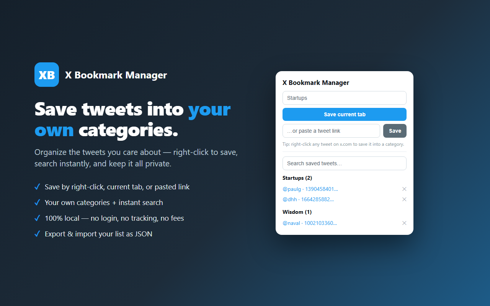

# X Bookmark Manager

A lightweight Chrome extension for saving tweets into **your own categories** —
fully local, no login, no tracking, no API fees.

## Features

- **Three ways to save** — right-click a tweet on x.com, save the current tab from the popup, or paste a tweet link.
- **Your own categories** — file each save under a category you choose; the right-click menu builds a submenu from your existing categories.
- **Instant search** — filter saved tweets by category, handle, tweet ID, or URL.
- **100% local** — everything is stored on your device via `chrome.storage.local`. Nothing is ever transmitted.
- **Backup & restore** — export your whole list to a JSON file and import it back on another machine.

## Install

### From source (developer mode)
1. Download or clone this repository.
2. Open `chrome://extensions` and enable **Developer mode** (top-right).
3. Click **Load unpacked** and select the project folder.
4. The icon appears in your toolbar.

## Usage

- **Right-click** any tweet (or its link) on x.com / twitter.com → **Save to X Bookmark Manager** → choose a category.
- **Toolbar popup** → type a category, then **Save current tab**, or paste a tweet link and **Save**.
- Browse, search, and remove saved tweets from the popup, grouped by category.
- Use **Export** / **Import** in the popup to back up or transfer your list.

## Permissions

| Permission | Why |
|---|---|
| `activeTab` | Read the current tab's URL when you click "Save current tab". |
| `storage` | Store your saved links and categories locally. |
| `contextMenus` | Add the right-click "Save to X Bookmark Manager" menu. |

No host permissions, no remote code, no network requests.

## Privacy

X Bookmark Manager collects nothing and transmits nothing — all data stays on
your device. See the [privacy policy](https://ribmc95.github.io/X-BM-manager/privacy.html).

## Development

The extension is plain JavaScript (Manifest V3) with no build step:

| File | Role |
|---|---|
| `manifest.json` | Extension manifest (MV3). |
| `background.js` | Service worker — context menu + save logic. |
| `popup.html` / `popup.js` | Popup UI — save, search, list, export/import. |

Code style is enforced with [`clang-format`](.clang-format) (Allman braces, 4-space indent).

## License

© 2026 X Bookmark Manager.
